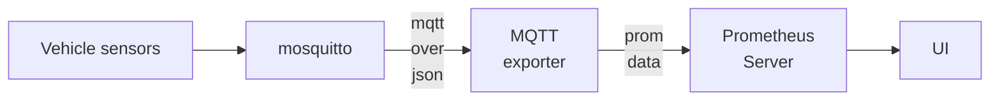
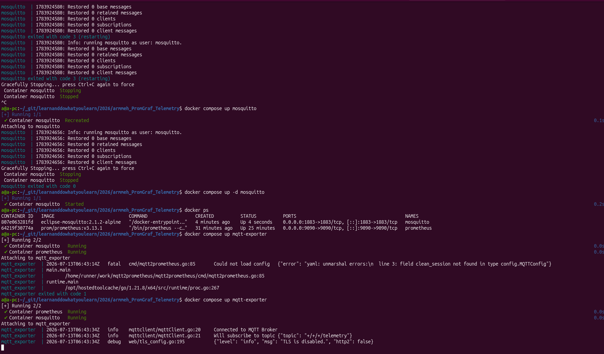
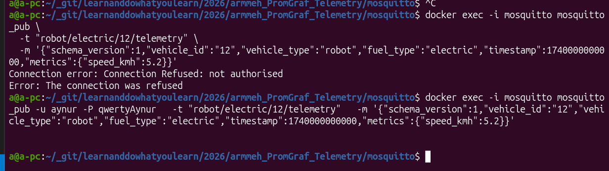

# armmeh_PromGraf_Telemetry

## Архитектура

or

## mosquitto суета:

sudo chown 1883:1883 mosquitto/config/password.txt
$ docker exec -it mosquitto mosquitto_passwd -b /mosquitto/config/password.txt aynur qwertyAynur

Искреннее уважение к разработчикам этих инструментов за понятные тексты ошибок:

Креди пробросить удалось, тест без авторизации показал защиту, а с авторизацией показал, что mqtt экспортер получил сообщение. Дальше надо настроить Прометеус на подписку к этому экспортеру.

Дальше настраивала Прометеус. Источник настроила, хотелось поля получить из пути. Пока через москито конфигурацию не получилось, пока только в промметеусе сделала. Может это и лучше вариант - в прометеусе, а не в москито разбирать по пути топика тип топлива, машину и id машины.

Задание

Преподаватель: Екатерина Лугано

**О компании**:
Априорные Решения Машин
Российский разработчик и производитель комплексных решений в области машиностроения. Мы специализируемся на разработке компонентов и систем для различных отраслей.

**Цель**:
настройка системы мониторинга метрик и телеметрии Prometheus + Grafana.

**Описание**:

Назначение и область применения
Развернуть систему сбора, хранения и визуализации метрик для мониторинга парка транспортных средств (ТС) в реальном времени.
В число объектов мониторинга входят:

* ВАТС (высокоавтоматизированные ТС);
* обычная техника. Разнообразные модели тракторов, погрузчиков, транспортных тележек;
* серверная инфраструктура порталов Телеметрии и FMS (Fleet Management System).

Данные с ТС поступают в формате MQTT-топиков. Необходимо обеспечить их приём, преобразование в метрики Prometheus и визуализацию в Grafana.

Цель работы

Настроить рабочий стенд Prometheus + Grafana, который позволяет:

    в реальном времени отслеживать состояние парка техники и серверов;
    строить дашборды;
    получать оповещения о критических событиях.

Основные задачи

    Развертывание инфраструктуры мониторинга

    Развернуть Prometheus и Grafana на сервере (рекомендуется с помощью Docker Compose);
    настроить хранение метрик;
    обеспечить доступ к веб-интерфейсу Grafana для просмотра дашбордов.

2. Настройка приёма телеметрических данных из MQTT

Выбрать и настроить MQTT экспортер, который:

    подключается к MQTT-брокеру и подписывается на топики с телеметрией;
    парсит JSON-сообщения и преобразует их в метрики Prometheus;
    открывает HTTP-эндпоинт /metrics для сбора Prometheus’ом;
    настроить Prometheus на сбор метрик с этого экспортера.

3. Настройка сбора метрик с серверных сервисов

Настроить сбор метрик с:

    Backend API платформы Телематики и FMS (если есть /metrics эндпоинт);
    PostgreSQL/TimescaleDB (использовать postgres_exporter).

4. Создание дашбордов в Grafana
В таблице 1 приведены описания дашбордов Grafana, которые необходимо разработать:
Дашборд 	Назначение 	Примеры графиков
«Состояние парка» 	Общий мониторинг всей техники 	Список машин с индикаторами онлайн/офлайн, последние GPS координаты и тд
«Детальный статус трактора» 	Анализ конкретного ТС 	Графики скорости, GPS-трека, загрузки CPU, температуры, статуса RTK, уровня топлива и тд
«Серверная инфраструктура» 	Мониторинг серверов 	Загрузка CPU/RAM серверов, доступность сервисов, состояние БД, размер диска и тд

Таблица 1. Описание дашбордов Grafana

Дашборды должны быть интерактивными: с фильтрами по времени, выбором конкретного ТС и возможностью детализации. Дашборды должны использовать данные из Prometheus, который, в свою очередь, получает данные из MQTT-экспортера

5. Настройка алертов
Настроить оповещения (Telegram / Email) о критических событиях:

    потеря связи с трактором > 5 минут;
    температура вычислителя > 75°C;
    статус RTK = None более 30 секунд;
    и тд.

6. Документирование

Необходимо составить инструкцию по развертыванию системы, описать структуру метрик и дашбордов.

    Ожидаемые результаты
    Работающий стенд Prometheus + Grafana, доступный по ссылке;
    настроенный MQTT-экспортер, принимающий данные из топиков и преобразующий их в метрики Prometheus;
    настроенные дашборды в Grafana;
    настроенные алерты в Telegram (или Email);
    документация по развертыванию и описание системы.

resourses:

* https://prometheus.io/docs/instrumenting/exporters/

* https://github.com/hikhvar/mqtt2prometheus
* https://github.com/prometheus-community/postgres_exporter

* https://hub.docker.com/r/prom/prometheus/tags
