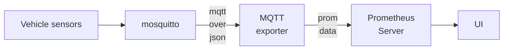
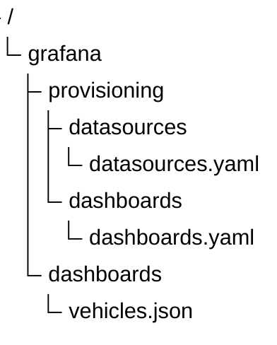

# armmeh_PromGraf_Telemetry

## Архитектура



or


## mosquitto суета:

sudo chown 1883:1883 mosquitto/config/password.txt
$ docker exec -it mosquitto mosquitto_passwd -b /mosquitto/config/password.txt aynur qwertyAynur

Искреннее уважение к разработчикам этих инструментов за понятные тексты ошибок:


Креди пробросить удалось, тест без авторизации показал защиту, а с авторизацией показал, что mqtt экспортер получил сообщение. Дальше надо настроить Прометеус на подписку к этому экспортеру.


Дальше настраивала Прометеус. Источник настроила, хотелось поля получить из пути. Пока через москито конфигурацию не получилось, пока только в промметеусе сделала. Может это и лучше вариант - в прометеусе, а не в москито разбирать по пути топика тип топлива, машину и id машины.


##  подход Dashboard-as-Code for Grafana (или Provisioning).




Node exporter full got there: https://grafana.com/grafana/dashboards/1860-node-exporter-full/


Futher dos:
* Добавление Grafana Loki в этот же Compose-стек для сбора и анализа текстового массива "events" из  JSON-сообщений.
* Настройка Prometheus *Alertmanager для отправки алертов в Telegram/Slack, если у трактора упадет давление масла или пропадет связь.
* Docker-образа Go-приложения через Multi-stage build для деплоя.


## Оцениваю ресурсы для ВМ

Оценка базируется на умеренной нагрузке (45 симуляционных устройств/метрик в секунду):Компонент / СервисvCPU (базовый)RAM (мин. / комфортно)Диск (хранение)ПримечаниеСимулятор + Бот0.2150 – 300 МБ< 1 ГБЗависит от сложности кода имитацииMosquitto + MQTT Exporter0.150 – 100 МБ< 1 ГБПамять растет при росте числа топиковPrometheus0.3500 – 800 МБ10 ГБ (лимит в коде)Память сильно зависит от количества Time SeriesVictoriaMetrics0.2200 – 400 МБ5 – 10 ГБЭнергоэффективна, жмет данные лучше PrometheusPostgreSQL 170.2500 – 1000 МБ10 – 15 ГБПо умолчанию резервирует буферы в RAMGrafana0.1150 – 250 МБ< 2 ГБПамять нужна в основном для дашбордовЭкспортеры (Node, Postgres)0.150 – 100 МБ0 ГБТолько CPU на сбор метрикОС (Ubuntu 24.04/22.04) + Docker0.2600 – 800 МБ~8 ГБСистемные нужды и логи контейнеровИТОГО (Минимум)1.4 vCPU~3.2 ГБ~35 ГББаланс без запаса прочностиИТОГО (Рекомендуемый)2 vCPU4 ГБ40 ГБГарантирует стабильность без OOM-killer
## create password for nginx 

```
docker run --rm -ti alpine sh -c "apk add --no-cache apache2-utils && htpasswd -nb admin secret_password"
```

resourses:

* https://prometheus.io/docs/instrumenting/exporters/

* https://github.com/hikhvar/mqtt2prometheus
* https://github.com/prometheus-community/postgres_exporter

* https://hub.docker.com/r/prom/prometheus/tags
* https://grafana.com/blog/how-to-integrate-grafana-alerting-and-telegram/ 
